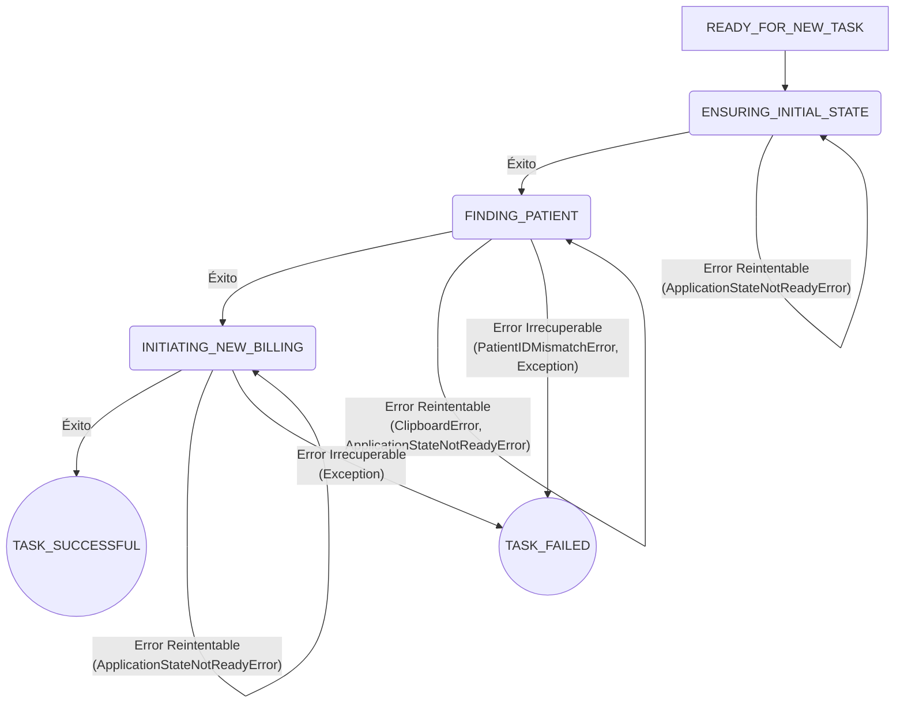

# 01. El Motor de Workflow (Estado v0.8.0)

**Misión de este Documento:** Explicar la arquitectura y el funcionamiento del componente central que orquesta la lógica de automatización en la versión `v0.8.0` del `Praxis Heuristic Engine`. Este componente es el **cerebro** del motor, responsable de ejecutar cada tarea de principio a fin de manera controlada y resiliente.

**Audiencia:** Desarrolladores, Arquitectos.

---

## 1. Contexto Histórico: De Script a Cerebro

En sus inicios, el motor ejecutaba las tareas como un simple script secuencial. Este enfoque resultó ser extremadamente frágil; cualquier error inesperado o retraso en la GUI provocaba un fallo catastrófico e irrecuperable de todo el proceso por lotes.

El componente `RemoteAutomator` (`src/automation/strategies/remote/automator.py`) nació como una respuesta directa a esta fragilidad. Su diseño se centró en un objetivo principal: **introducir la resiliencia**. Para ello, se abandonó el modelo secuencial y se adoptó una arquitectura basada en una **Máquina de Estados Finitos (FSM)**.

En la `v0.8.0`, este componente representa un **prototipo de motor de workflow**: es robusto y funcional para su misión actual, pero su lógica está fuertemente acoplada a un único proceso de negocio (la facturación médica).

## 2. Arquitectura y Principios de Diseño

El `RemoteAutomator` opera sobre tres principios de diseño fundamentales que le confieren su resiliencia.

### Principio 1: Orquestación mediante Máquina de Estados Finitos (FSM)

El ciclo de vida de cada tarea individual no es un flujo lineal, sino una serie de transiciones entre estados discretos y bien definidos. Esto permite que el motor sepa siempre "en qué paso estoy", lo que es crucial para la toma de decisiones y la recuperación de errores.

### Principio 2: Control de Flujo Dirigido por Excepciones

Las transiciones entre estados, especialmente las transiciones de fallo, no se gestionan con condicionales `if/else`. En su lugar, el motor utiliza una **jerarquía de excepciones personalizadas** como **eventos** que dirigen el flujo de la FSM.

Esto crea un sistema más limpio y declarativo:
*   El código de la "ruta feliz" (la secuencia de éxito) es lineal y fácil de leer.
*   Los escenarios de error son manejados por `handlers` de excepción específicos que deciden el siguiente estado.

El motor distingue entre dos tipos de fallos, basándose en la implementación del `try...except` en `automator.py`:
*   **Errores Reintentables Manejados Explícitamente:** Problemas transitorios como `ClipboardError` y `ApplicationStateNotReadyError`. La FSM permanece en el estado actual e incrementa un contador de reintentos.
*   **Errores Irrecuperables:** Fallos lógicos o de datos como `PatientIDMismatchError`, o cualquier `Exception` genérica e inesperada. La FSM transiciona inmediatamente al estado `TASK_FAILED`.

### Principio 3: Delegación a Handlers Especializados

El motor (`RemoteAutomator`) actúa como el **director de orquesta**, pero no toca ningún instrumento. Su única responsabilidad es decidir qué estado viene a continuación. La acción real dentro de cada estado (ej. "buscar un paciente") se delega a un `Handler` especializado. En la `v0.8.0`, el motor depende directamente del `MainWindowHandler`.

## 3. El Contrato del Workflow (Verificado para v0.8.0)

La siguiente sección describe de forma inequívoca la lógica de la FSM que está **codificada** dentro del `RemoteAutomator`. Es el "contrato" verificado de la misión de facturación.

### Diagrama de Flujo de Estados

### Tabla de Contrato Detallada

| Estado Actual (TaskState) | Acción del Handler Invocada | Transición en Éxito | Evento de Fallo (Excepción) | Transición en Fallo |
| :--- | :--- | :--- | :--- | :--- |
| **`READY_FOR_NEW_TASK`** | (Ninguna) | `ENSURING_INITIAL_STATE` | - | - |
| **`ENSURING_INITIAL_STATE`** | `main_window_handler.ensure_initial_state()` | `FINDING_PATIENT` | `ApplicationStateNotReadyError`, `ClipboardError` | **Reintento** en el estado actual |
| | | | `Exception` (genérica) | `TASK_FAILED` (Irrecuperable) |
| **`FINDING_PATIENT`** | `main_window_handler.find_patient()` | `INITIATING_NEW_BILLING` | `ApplicationStateNotReadyError`, `ClipboardError` | **Reintento** en el estado actual |
| | | | `PatientIDMismatchError` | `TASK_FAILED` (Irrecuperable) |
| | | | `Exception` (genérica) | `TASK_FAILED` (Irrecuperable) |
| **`INITIATING_NEW_BILLING`** | `main_window_handler.initiate_new_billing()`| `TASK_SUCCESSFUL` | `ApplicationStateNotReadyError`, `ClipboardError` | **Reintento** en el estado actual |
| | | | `Exception` (genérica) | `TASK_FAILED` (Irrecuperable) |
| **`TASK_SUCCESSFUL`** | (Estado terminal) | (Finaliza bucle) | - | - |
| **`TASK_FAILED`** | (Estado terminal) | (Finaliza bucle) | - | - |

## 4. Limitaciones y Deuda Técnica (v0.8.0)

1.  **Acoplamiento Fuerte al Workflow:** La lógica de la FSM (estados, transiciones, excepciones) está **codificada directamente** en el `RemoteAutomator`. No es un motor genérico; es un ejecutor especializado en la misión de facturación. Para ejecutar un workflow diferente, sería necesario modificar su código fuente.
2.  **Conocimiento Implícito de Dependencias:** El motor asume la existencia del `MainWindowHandler`. No hay un mecanismo para descubrir o cargar `Handlers` de forma dinámica según la misión.

## 5. Hoja de Ruta y Evolución

Las limitaciones actuales son el principal motor de la evolución del proyecto. La visión a largo plazo es transformar este componente de un ejecutor especializado a un verdadero motor de workflows genérico.

*   **Hito 0 (El Manifiesto de la Misión):** Abordará directamente el acoplamiento del workflow. La lógica de la FSM se extraerá del código Python y se definirá en un archivo de configuración declarativo (ej. JSON). El `RemoteAutomator` evolucionará a un `WorkflowEngine` que simplemente interpreta este manifiesto, permitiéndole ejecutar cualquier misión sin necesidad de ser modificado.

---
`[ Volver al Índice de la Biblioteca ]`
