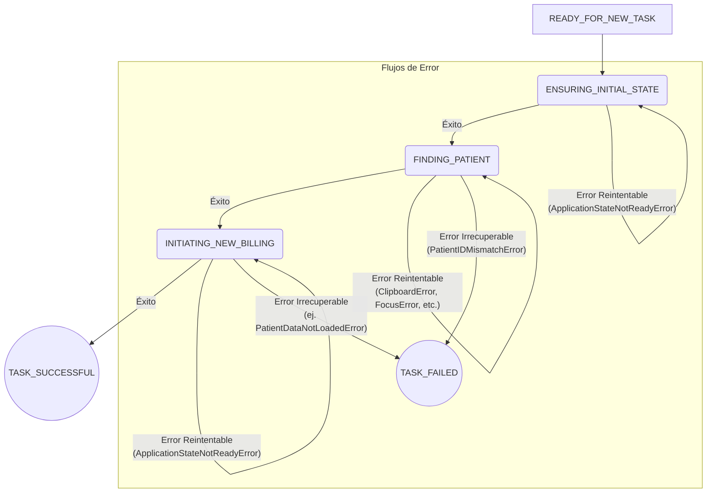

# ADR-002: Adopción de una Máquina de Estados Finitos (FSM) para la Gestión Resiliente de Tareas

**Fecha:** 13/09/2025
**Estado:** Aceptado

---

## 1. Contexto del Problema: La Fragilidad del Bucle Ingenuo

En las primeras etapas de desarrollo (post-`ad9e6f4`), el `RemoteAutomator` operaba con un bucle `for` simple y lineal. Este "bucle ingenuo" ejecutaba cada paso de una tarea de forma secuencial, sin conciencia de su propio estado ni capacidad de recuperación.

Esta arquitectura, combinada con la inherente fragilidad de la capa de interacción "ciega" (`ADR-001`), llevó rápidamente a problemas operativos críticos:

*   **Fallas Catastróficas:** Cualquier interrupción (latencia, pérdida de foco, un pop-up) provocaba una excepción que detenía la ejecución de **todo el lote de tareas**.
*   **Gestión de Errores Indiferenciada:** El sistema era incapaz de distinguir entre un `ClipboardError` (un problema técnico transitorio) y un `PatientIDMismatchError` (un fallo lógico de datos). Ambos tenían la misma consecuencia fatal.
*   **Falta de Conciencia Situacional:** El motor no sabía "dónde estaba" en el flujo (ej. buscando paciente, iniciando factura), lo que impedía cualquier lógica de recuperación.

La necesidad de introducir inteligencia y resiliencia se hizo imperativa. El primer paso habilitador fue la introducción de una **jerarquía de excepciones estructurada** (commit `357ae86`), que proporcionó los "eventos" tipificados que una FSM necesitaría para reaccionar de forma específica.

## 2. Decisión

Se decidió refactorizar el `RemoteAutomator` (`src/automation/strategies/remote/automator.py`) para operar como una **Máquina de Estados Finitos (FSM) dirigida por excepciones**. El objetivo era introducir resiliencia, control de flujo granular y una lógica de reintentos configurable.

La implementación central de esta decisión se encuentra en el commit `e813dd8` (*feat(automation): implement robust FSM for task processing*). Los elementos clave fueron:

1.  **Definición de Estados Explícitos:** Se creó el `Enum` `TaskState` (`src/automation/common/states.py`) para definir los estados discretos del workflow de facturación (`ENSURING_INITIAL_STATE`, `FINDING_PATIENT`, etc.).

2.  **Lógica de Transición Centralizada:** El `RemoteAutomator` se reescribió con un bucle `while True` que evalúa el `current_state` y delega la ejecución a `Handlers`. Las transiciones de éxito actualizan explícitamente el `current_state`.

3.  **Control de Flujo por Excepciones:** Se usaron bloques `try...except` para capturar las excepciones personalizadas. Estas excepciones actúan como **eventos** que dirigen el flujo de la FSM hacia estados de reintento o de fallo.

4.  **Mecanismo de Reintentos Configurable:** Para excepciones reintentables (como `ClipboardError` y `ApplicationStateNotReadyError`), la FSM permanece en el estado actual e intenta la acción de nuevo hasta agotar los `max_retries` definidos en el perfil `.ini`.

### Diagrama de la Máquina de Estados Finitos (FSM v0.8.0 - Misión Facturación)

El siguiente diagrama representa fielmente la lógica de control de flujo implementada en `RemoteAutomator.py` para la `v0.8.0`.

## 3. Consecuencias

La adopción de la FSM fue el hito más transformador para la fiabilidad del motor en la `v0.8.0`. Sin embargo, en esta implementación, también consolidó una deuda técnica crítica.

### Positivas:

*   **Resiliencia Operativa Drásticamente Mejorada:** El motor ganó la capacidad de gestionar y recuperarse de fallos transitorios. La interrupción de una tarea ya no significaba el fin de todo el lote.
*   **Manejo de Errores Granular:** La FSM, impulsada por excepciones, permitió diferenciar y reaccionar de manera inteligente a distintos tipos de fallos (reintentar vs. abortar).
*   **Mejoras en Diagnóstico y Trazabilidad:** La estructura de la FSM, junto con la generación de reportes (commit `1844cea`), proporcionó una visibilidad sin precedentes sobre el *porqué* y el *dónde* (`failed_at_state`) de los fallos.
*   **Base para la Observabilidad Avanzada:** La FSM se convirtió en el punto de integración natural para características de diagnóstico como la captura de pantalla en caso de errores inesperados (commit `72e1080`).

### Negativas o Riesgos (Deuda Técnica Introducida):

*   **Acoplamiento Fuerte al Workflow Específico:** La FSM, tal como está implementada en la `v0.8.0`, está **completamente codificada y cableada dentro del `RemoteAutomator`**. Sus estados, transiciones y la invocación de `Handlers` son monolíticos y específicos para la misión de facturación.
    *   **Implicación:** El `RemoteAutomator` no es un "motor de FSM" genérico. Para ejecutar un workflow diferente, sería necesario modificar su código fuente, lo que viola directamente el principio de un motor genérico y guiado por configuración.
    *   **Justificación de la Hoja de Ruta Futura:** Esta es la **deuda técnica más significativa** consolidada en la `v0.8.0` y la principal motivación para el **Hito 0: El Manifiesto de la Misión**, cuyo objetivo es externalizar la definición de la FSM a un archivo de configuración declarativo.

---
`[ Volver al Índice de la Biblioteca ]`
