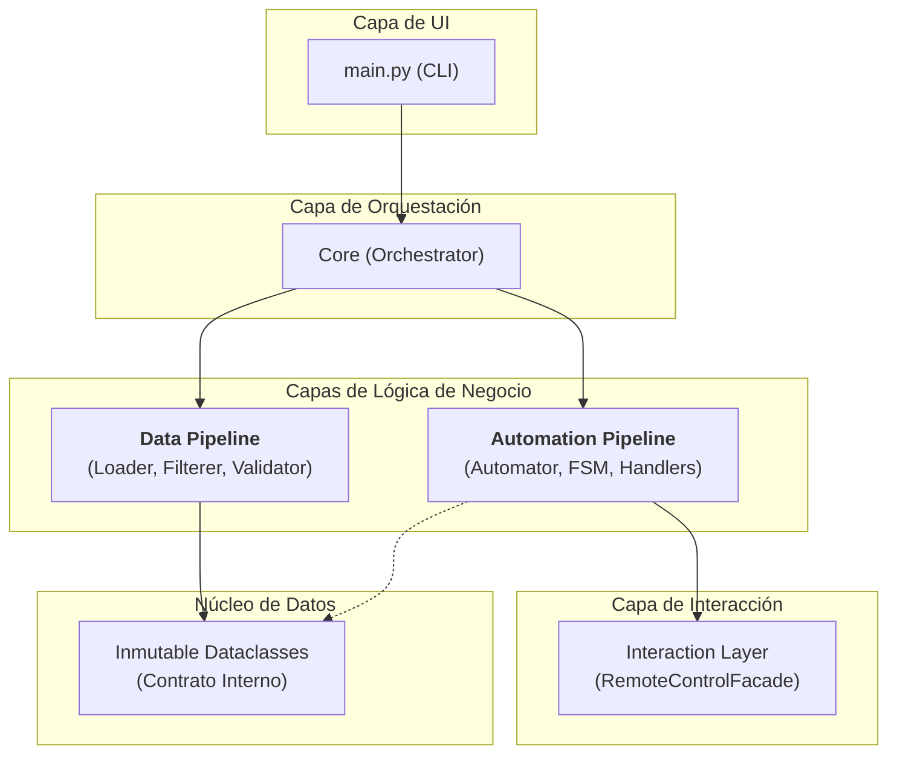

# Praxis Heuristic Engine - Guía de Arquitectura

**Versión del Documento:** 1.0 (Corresponde al tag `v0.8.0` del software)
**Audiencia:** Arquitectos, Desarrolladores (actuales y futuros)

## 1. Misión y Filosofía

Este documento es la **fuente única de verdad** para la arquitectura del `Praxis Heuristic Engine`. Su propósito es describir la estructura, los principios de diseño y la hoja de ruta evolutiva del sistema en su estado `v0.8.0`.

El `Praxis Heuristic Engine` es un motor de RPA de alta resiliencia, diseñado para ser una **plataforma genérica** capaz de ejecutar diversos workflows ("misiones"). Su desarrollo se rige por una filosofía que prioriza la resiliencia, la mantenibilidad y la adaptabilidad a largo plazo.

---

## 2. Contexto Histórico y Evolución Arquitectónica

La arquitectura de la `v0.8.0` no es un diseño monolítico, sino el **resultado de una evolución forjada por restricciones y descubrimientos**. Comprender este viaje es clave para entender el porqué de su estado actual.

#### **Fase 1: El Autómata Táctico (El "Bot")**

El proyecto nació con un objetivo simple y directo: automatizar un proceso manual de facturación médica. La restricción fundamental fue la necesidad de operar a través de un **escritorio remoto**, lo que impuso un modelo de interacción "ciego":
*   **Control:** Exclusivamente por emulación de teclado.
*   **Percepción:** Exclusivamente a través del portapapeles del sistema.

Esta fase inicial produjo la primera versión de `RemoteControlFacade` y un script secuencial simple.

#### **Fase 2: El Despertar de la Resiliencia**

El enfoque inicial demostró ser funcional pero extremadamente frágil. Como respuesta directa a esta fragilidad, se introdujeron dos cambios arquitectónicos clave:
1.  **Jerarquía de Excepciones Personalizadas:** Se dejó de tratar los errores como eventos terminales y se empezaron a ver como **eventos de negocio** que podían ser manejados.
2.  **Máquina de Estados Finitos (FSM):** Se reemplazó el script secuencial por una FSM robusta dentro del `RemoteAutomator`. Esto permitió un control de flujo sofisticado, con lógica de reintentos y estados de fallo controlados.

#### **Fase 3: El Pivote Estratégico hacia una Plataforma**

La creciente complejidad y la necesidad de un ciclo de desarrollo más rápido llevaron a la creación del **ecosistema de soporte**:
*   **El `Stunt Action Facsimile` (SAF):** Un gemelo digital que desacopló el desarrollo del entorno de producción.
*   **La `Toolchain` (`scripts/`):** Herramientas para la anonimización de datos y la generación de configuraciones.

Este fue el punto de inflexión. El proyecto acumuló capacidades que trascendían su misión original. Se hizo evidente que habíamos construido el prototipo de un **motor genérico**. Este pivote estratégico ocurrió **antes de completar la implementación de la misión de facturación original**, lo que explica por qué varios `Handlers` (`egreso_handler`, `lotes_handler`, etc.) existen en la `v0.8.0` como `placeholders` vacíos.

La `v0.8.0` encapsula, por tanto, el final de esta evolución: es un **prototipo de motor robusto y bien probado, validado con la implementación parcial de su primera misión.**

---

## 3. Arquitectura Detallada (Estado v0.8.0)

El sistema adopta una arquitectura de capas estricta:

### 3.1. Componentes Clave Implementados

| Componente | Ubicación | Responsabilidad en v0.8.0 |
| :--- | :--- | :--- |
| **`Orchestrator`** | `src/core/orchestrator.py` | Cerebro de la aplicación. Ensambla y coordina los pipelines. Genera los reportes finales. |
| **`Data Pipeline`** | `src/data_handler/` | Ingesta de datos: carga, sanea, filtra y valida los datos de entrada, produciendo `dataclasses` limpias. |
| **`RemoteAutomator`** | `.../remote/automator.py`| **Prototipo de motor de workflow.** Implementa una FSM **codificada y fuertemente acoplada** al workflow de facturación. Gestiona el flujo y los reintentos. |
| **`Handlers`** | `.../remote/handlers/`| Encapsulan la lógica de negocio y la navegación "ciega". **Solo `MainWindowHandler` tiene una implementación sustancial; los demás son `placeholders` de la misión original.** |
| **`RemoteControlFacade`**| `.../remote/remote_control.py` | Abstrae la interacción con el SO (`pywinauto`). **Fusiona responsabilidades de Acción (teclado) y Percepción (portapapeles).** |
| **`SAF (v0.2)`** | `saf/` | Gemelo digital MVC de la ventana principal del SF, permitiendo pruebas de integración E2E. |

---

## 4. El Puente al Futuro: De las Limitaciones a la Visión

La arquitectura `v0.8.0` es el punto de partida. Sus limitaciones actuales son precisamente las que definen nuestra hoja de ruta estratégica. Cada debilidad identificada se aborda con un hito de evolución concreto.

| Limitación en v0.8.0 | Hito Estratégico de Solución | Resultado Esperado (Transformación) |
| :--- | :--- | :--- |
| **Navegación Ciega y Frágil** La lógica de movimiento (`{TAB}s`) está codificada y es propensa a romperse. | **Hito 3: El Navegante Consciente** | Se introduce un `GuiMap` y un `Navigator` que planifica y **verifica** cada movimiento. El bot sabe dónde está en todo momento. |
| **Motor Monolítico (FSM Codificada)** El `RemoteAutomator` solo puede ejecutar un workflow. No es un motor genérico. | **Hito 0: El Manifiesto de la Misión** | El `RemoteAutomator` evoluciona a un `WorkflowEngine` que lee manifiestos de misión declarativos (ej. JSON). |
| **Percepción Acoplada** El motor solo puede "ver" con el portapapeles. No se pueden añadir nuevos "sentidos" como OCR. | **Hito 2: La Abstracción de la Percepción** | Se separa la interacción en una `ActionFacade` y una `PerceptionInterface`, permitiendo estrategias de percepción intercambiables. |
| **Estado Volátil** El motor es amnésico y no puede reanudar un trabajo interrumpido. | **Hito Futuro (Post 1.0): Gestión de Estado** | Introducir un mecanismo de persistencia para que los workflows largos puedan ser pausados y reanudados. |
| **Conocimiento Implícito de Datos** El motor valida la sintaxis de los datos, pero no su lógica de negocio. | **Hito 1: El Guardián de la Entrada** | Añadir una capa de `SanityValidator` que aplica reglas de negocio para rechazar datos lógicamente absurdos. |

---

## 5. Principios de Diseño Fundamentales (Estado v0.8.0)

Estos son los pilares sobre los que se asienta la versión actual y que guiarán su futuro desarrollo:

1.  **Doctrina de "Simulation-First":** La calidad se garantiza mediante el desarrollo y pruebas contra un gemelo digital (`SAF`). Esto es un principio no negociable.
2.  **Desarrollo Guiado por Configuración:** El comportamiento operativo del motor debe estar externalizado a archivos de configuración. El código implementa capacidades; la configuración define la misión.
3.  **Inmutabilidad del Núcleo:** El flujo de datos interno opera sobre modelos inmutables para garantizar la predictibilidad y la seguridad.
4.  **Falla Inteligentemente:** Las excepciones son una herramienta de control de flujo, no un final inesperado.
5.  **Experiencia del Desarrollador (DevEx) como Prioridad:** El motor y su ecosistema deben ser diseñados para que configurar, probar y extender nuevas misiones sea un proceso lo más simple y fiable posible.

---
`[ Volver al Índice de la Biblioteca ]`
